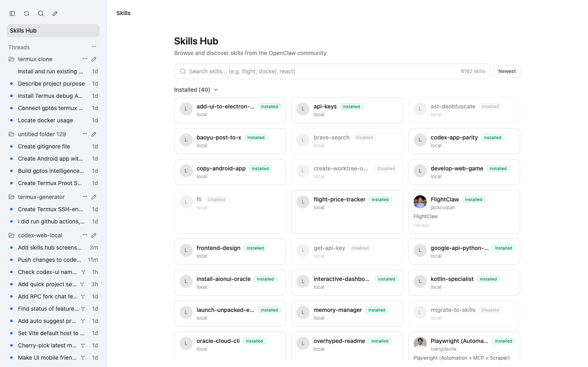
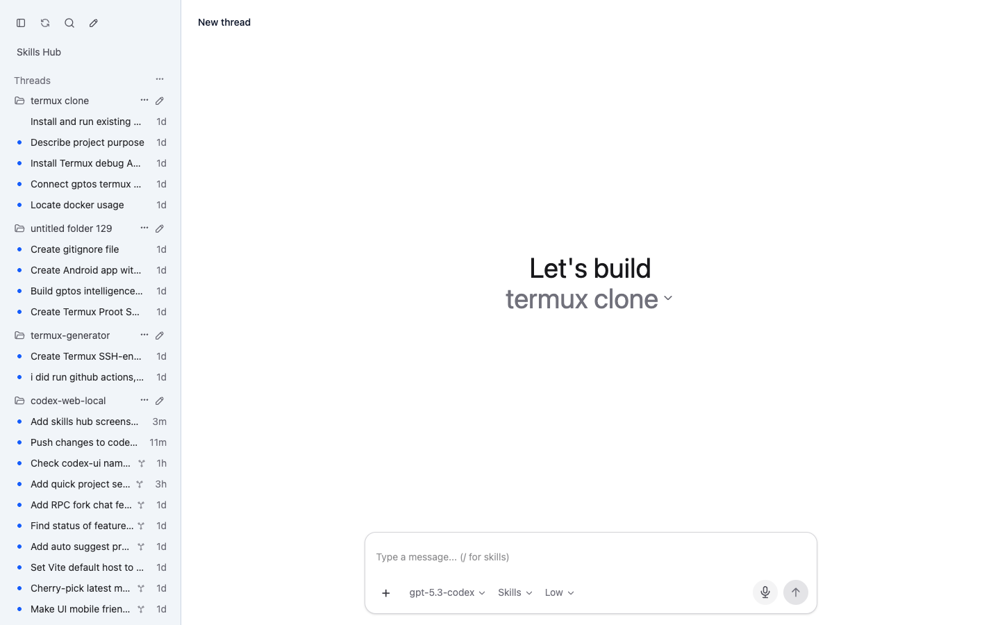

# 🔥 codes

### 🚀 Run Codex App UI Anywhere: Linux or Windows 🚀

[](https://www.npmjs.com/package/codes)
[](#-quick-start)
[](https://nodejs.org/)
[](./LICENSE)

> **CodeS in your browser. No drama. One command.**
>  
> **Yes, that is your Codex desktop app experience exposed over web UI. Yes, it runs cross-platform.**

```text
 ██████╗ ██████╗ ██████╗ ███████╗██╗  ██╗██╗   ██╗██╗
██╔════╝██╔═══██╗██╔══██╗██╔════╝╚██╗██╔╝██║   ██║██║
██║     ██║   ██║██║  ██║█████╗   ╚███╔╝ ██║   ██║██║
██║     ██║   ██║██║  ██║██╔══╝   ██╔██╗ ██║   ██║██║
╚██████╗╚██████╔╝██████╔╝███████╗██╔╝ ██╗╚██████╔╝██║
 ╚═════╝ ╚═════╝ ╚═════╝ ╚══════╝╚═╝  ╚═╝ ╚═════╝ ╚═╝
```

---


## 🤯 What Is This?
**`codes`** is a lightweight bridge that gives you a browser-accessible UI for Codex app-server workflows.

You run one command. It starts a local web server. You open it from your machine, your LAN, or wherever your setup allows.  

**TL;DR 🧠: Codex app UI, unlocked for Linux and Windows setups.**

---

## ⚡ Quick Start
> **The main event.**

```bash
# 🔓 Run instantly (recommended)
npx codes

# 🌐 Then open in browser
# http://localhost:18923
```

The CLI prints local and LAN URLs in startup output. Use the password shown in the same output when opening from another device on the same network.

If Codex is already authenticated and you do not want `codes` to force `codex login` during startup, use:

```bash
npx codes --no-login
```

### Linux 🐧
```bash
node -v   # should be 18+
npx codes
```

### Windows 🪟 (PowerShell)
```powershell
node -v   # 18+
npx codes
```

## ✨ Features
> **The payload.**

- 🚀 One-command launch with `npx codes`
- 🌍 Cross-platform support for Linux and Windows
- 🖥️ Browser-first CodeS flow on `http://localhost:18923`
- 🌐 LAN-friendly access from other devices on the same network
- 🧪 Remote/headless-friendly setup for server-based Codex usage
- ⚡ No global install required for quick experimentation
- 🎙️ Built-in hold-to-dictate voice input with transcription to composer draft
- 🧩 Local Skills Hub and composer skill picker backed by Codex local skills
- 🤖 Optional Telegram bot bridge: send messages to bot, forward into mapped thread, send assistant reply back to Telegram

### Telegram Bot Bridge (Optional)

Set these environment variables before starting `codes`:

```bash
export TELEGRAM_BOT_TOKEN="<your-telegram-bot-token>"
export TELEGRAM_ALLOWED_USER_IDS="<your-telegram-user-id>,<optional-second-id>"
export TELEGRAM_DEFAULT_CWD="$PWD" # optional, defaults to current working directory
npx codes
```

`TELEGRAM_ALLOWED_USER_IDS` is required for safe access. Only allowlisted Telegram user IDs can use the bridge. If no allowed user IDs are configured, incoming Telegram messages are rejected.

To find your Telegram user ID:

1. Send a message to your bot.
2. Run `curl "https://api.telegram.org/bot<your-telegram-bot-token>/getUpdates"`.
3. Read `message.from.id` from the returned update payload.

Bot commands:

- `/start` show quick help and thread picker
- `/threads` list recent threads and pick one
- `/newthread` create and map a new Codex thread for this Telegram chat
- `/thread <threadId>` map current Telegram chat to an existing thread
- `/current` show currently connected thread for this chat
- `/history` show recent history for current thread
- `/status` show bridge/mapping status
- `/whoami` show your Telegram user/chat IDs and authorization state
- `/help` show command reference

Outgoing assistant messages are sent with Telegram `parse_mode=HTML` for formatting, with automatic plain-text fallback if HTML delivery fails.

---

## 🧩 Recent Product Features (from main commits)
> **Not just launch. Actual UX upgrades.**

- 🗂️ Searchable project picker in new-thread flow
- ➕ "Create Project" button next to "Select folder" with browser prompt
- 📌 New projects get pinned to top automatically
- 🧠 Smart default new-project name suggestion via server-side free-directory scan (`New Project (N)`)
- 🔄 Project order persisted globally to workspace roots state
- 🧵 Optimistic in-progress threads preserved during refresh/poll cycles
- 📱 Mobile drawer sidebar in desktop layout (teleported overlay + swipe-friendly structure)
- 🎛️ Skills Hub mobile-friendly spacing/toolbar layout improvements
- 🪟 Skill detail modal tuned for mobile sheet-style behavior
- 🧪 Skills Hub event typing fix for `SkillCard` select emit compatibility
- 🎙️ Voice dictation flow in composer (`hold to dictate` -> transcribe -> append text)

---

## 🌍 What Can You Do With This?

| 🔥 Use Case | 💥 What You Get |
|---|---|
| 💻 Linux workstation | Run CodeS in browser without depending on desktop shell |
| 🪟 Windows machine | Launch web UI and access from Chrome/Edge quickly |
| 🧪 Remote dev box | Keep Codex process on server, view UI from client device |
| 🌐 LAN sharing | Open UI from another device on same network |
| 🧰 Headless workflows | Keep Codex process on the host and use the browser as the UI |
| ⚡ Fast experiments | `npx` run without full global setup |

---

## 🖼️ Screenshots

### Skills Hub


### Chat


### Mobile UI


---

## 🏗️ Architecture

```text
┌─────────────────────────────┐
│  Browser (Desktop/Mobile)   │
└──────────────┬──────────────┘
               │ HTTP/WebSocket
┌──────────────▼──────────────┐
│         codes            │
│  (Express + Vue UI bridge)  │
└──────────────┬──────────────┘
               │ RPC/Bridge calls
┌──────────────▼──────────────┐
│      Codex App Server       │
└─────────────────────────────┘
```

---

## 🎯 Requirements
- ✅ Node.js `18+`
- ✅ Codex app-server environment available
- ✅ Browser access to host/port
- ✅ Microphone permission (only for voice dictation)

---

## 🐛 Troubleshooting

| ❌ Problem | ✅ Fix |
|---|---|
| Port already in use | Run on a free port or stop old process |
| `npx` fails | Update npm/node, then retry |
| Can’t open from other device | Check firewall, bind address, and LAN routing |

---

## 🤝 Contributing
Issues and PRs are welcome.  
Bring bug reports, platform notes, and setup improvements.

---

## ⭐ Star This Repo
If you believe CodeS should be accessible from **any machine, any OS, any screen**, star this project and share it. ⭐

<div align="center">
Built for speed, portability, and a little bit of chaos 😏
</div>

---

Forked from [pavel-voronin/codex-web-local](https://github.com/pavel-voronin/codex-web-local) by Pavel Voronin.
